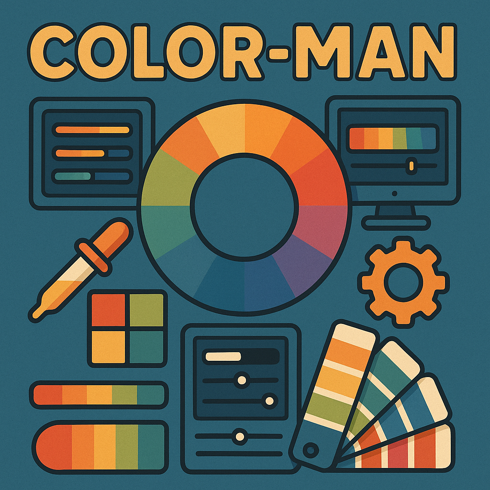

# ColorMan



Your one-stop shop for all things color manipulation

## What Sets ColorMan Apart

ColorMan isn't just another color picker - it's a comprehensive color experience:

- **Dynamic Palette Shifting**: Watch colors transform and evolve in real-time based on sophisticated color theory
- **Interactive Color Wheel**: Explore color relationships with our intuitive interface
- **Advanced Format Conversion**: Seamlessly switch between HEX, RGB, HSL, and more
- **Color Harmony Visualizer**: See complementary, analogous, and other relationships instantly
- **Accessibility Checker**: Ensure your color choices meet WCAG standards
- **Custom Color Psychology Insights**: Understand the emotional impact of your selections

Built with love by color science enthusiasts who believe color tools should be both powerful and delightful.

## Getting Started

Simply open `index.html` in your browser to begin your color journey.

```
git clone https://github.com/yourusername/colorMan.git
cd colorMan
open index.html
```

## Contributing

We welcome contributions from fellow color enthusiasts!

---
